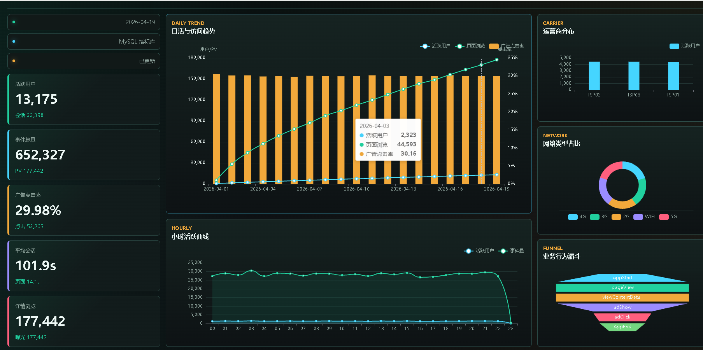
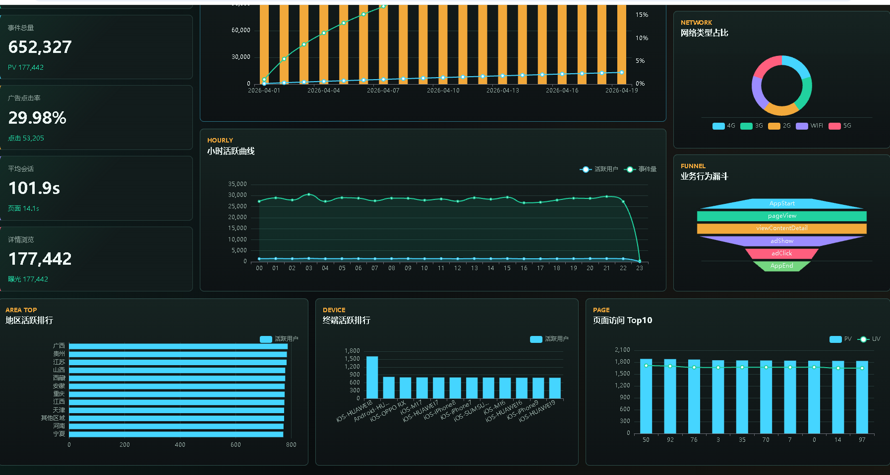
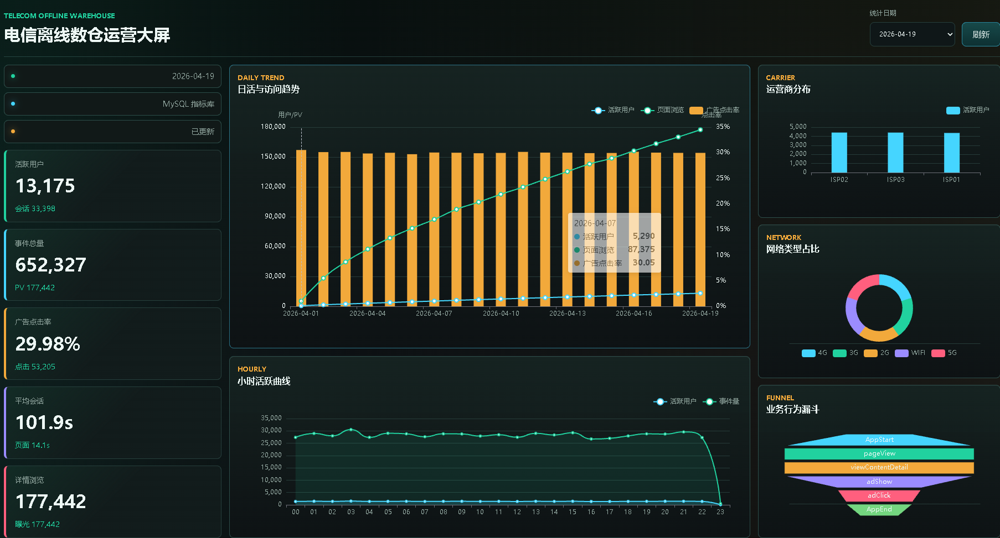
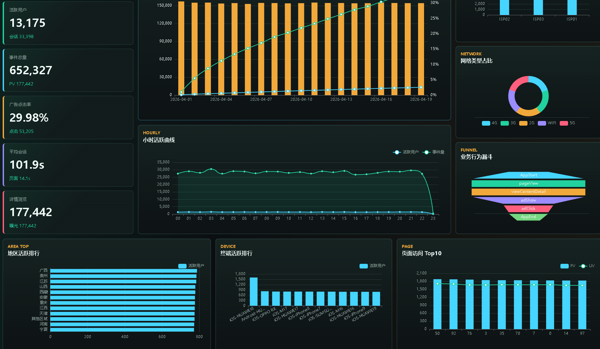
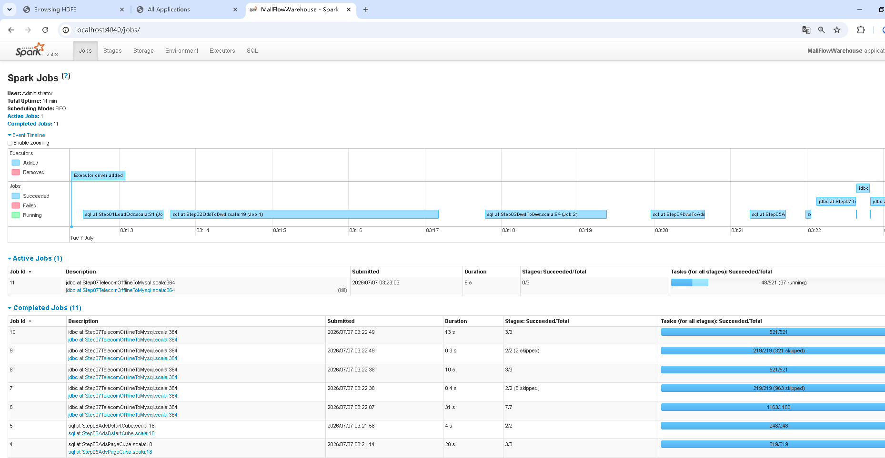
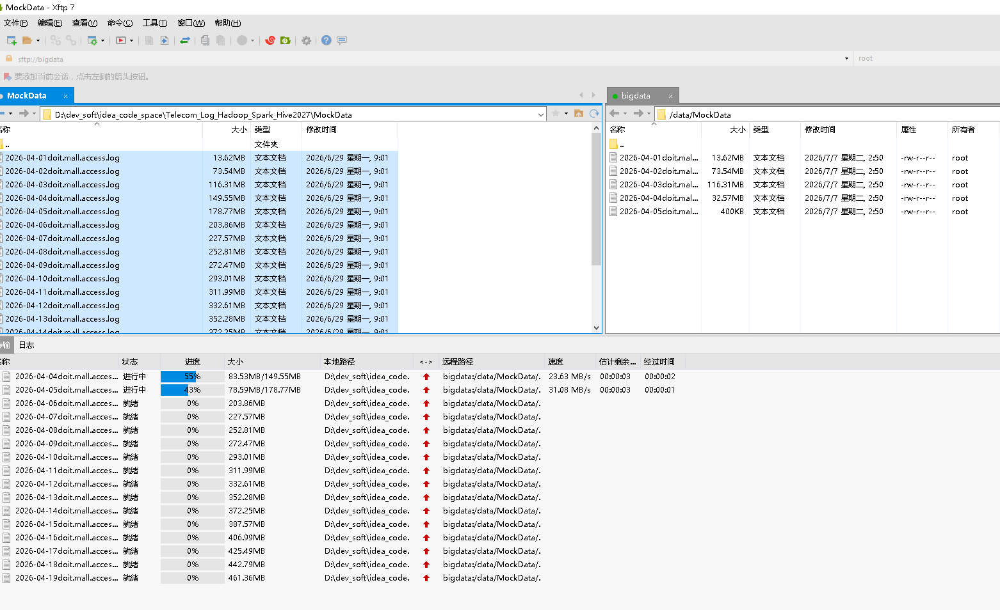
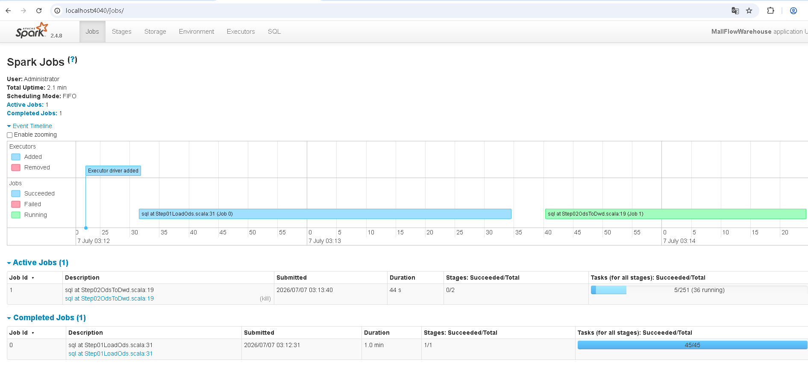
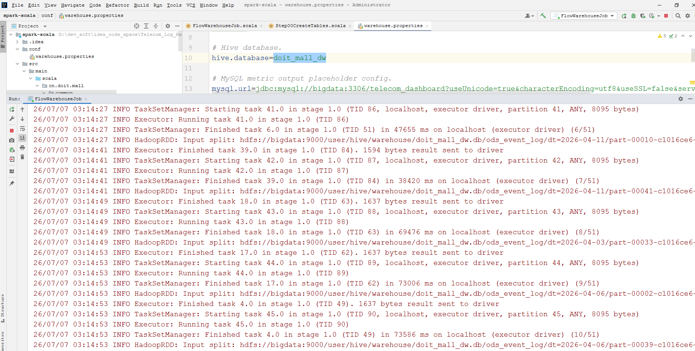
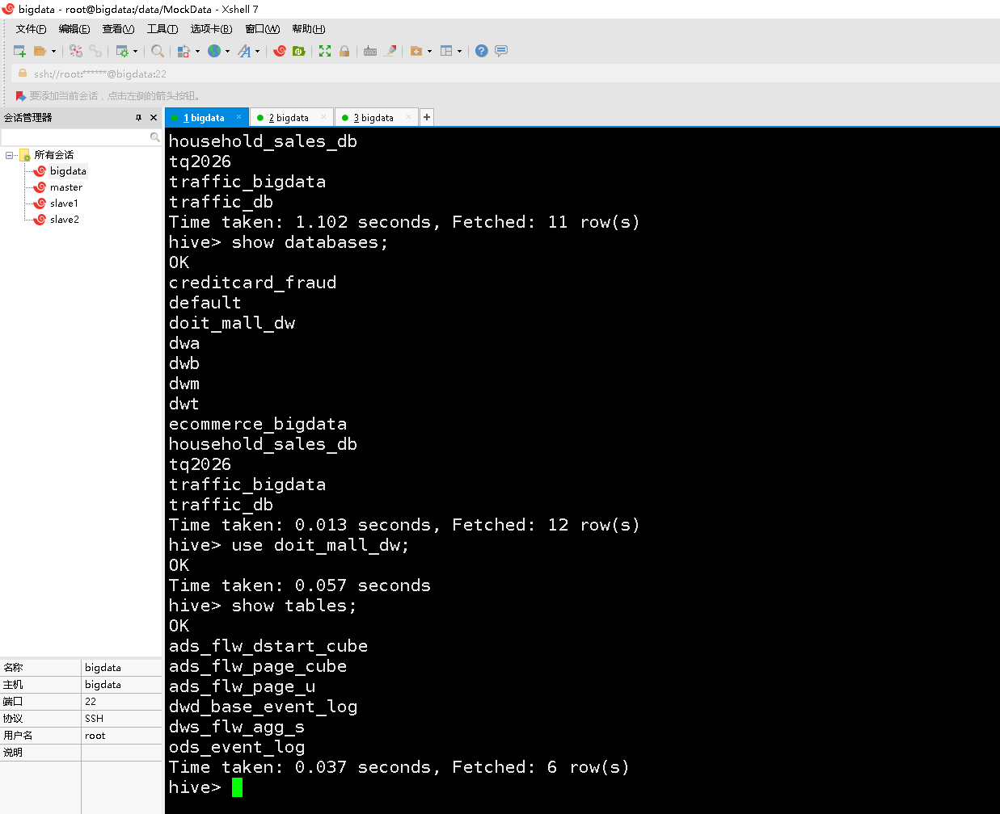

# 计算机毕业设计Hadoop+Spark+Hive电信日志分析 电信日志离线数仓  电信用户行为分析(源码+LW+PPT+讲解)

## 要求
### 源码有偿！一套(论文 PPT 源码+sql脚本+教程)

### 
### 加好友前帮忙start一下，并备注github有偿电信日志分析27
### 我的QQ号是2827724252或者微信:code520888 或者 bysj2023nb

# 

### 加qq好友说明（被部分 网友整得心力交瘁）：
    1.加好友务必按照格式备注
    2.避免浪费各自的时间！
    3.当“客服”不容易，repo 主是体面人，不爆粗，性格好，文明人。

## 运行演示视频

https://www.bilibili.com/video/BV1mtMs6zEYt/

## 项目介绍
本项目基于商城 APP 埋点日志数据，按照 ODS、DWD、DWS、ADS 数仓分层思想，完成原始日志接入、明细清洗、轻度汇总、应用指标计算等开发工作。项目选择流程图中的页面流量分析路线：
ods_event_log -> dwd_base_event_log -> dws_flw_agg_s -> ads_flw_page_u -> ads_flw_page_cube -> ads_flw_dstart_cube
该路线聚焦页面访问、用户访问、入口页面等指标，链路较清晰，适合作为完整数仓项目实现。

## 运行截图

